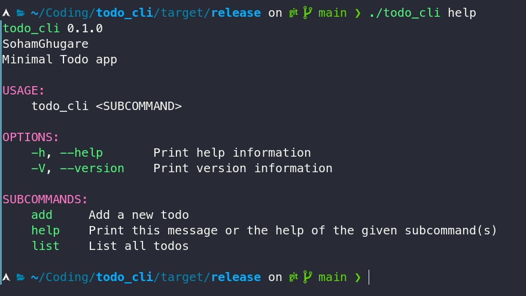
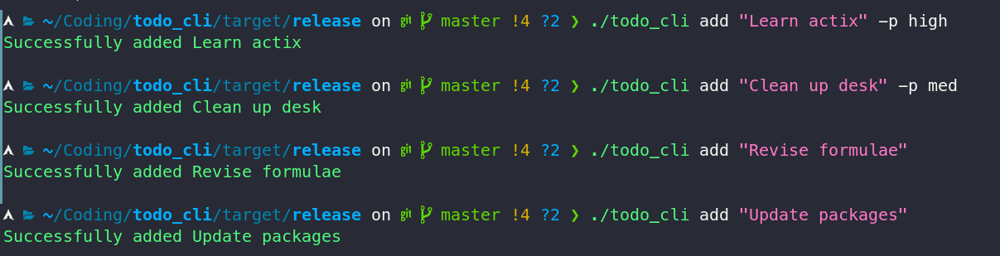
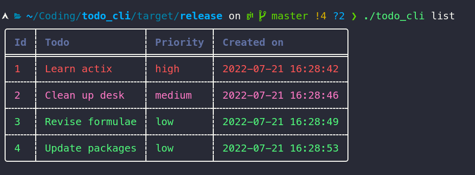

# Todo Cli App
### Built in Rust using Clap for Cli parsing

## Installation
**Pre-requisites: Must have cargo and rust installed on your machine**  

1. Clone this repository  
`$ git clone git@github.com:SohamGhugare/todo-cli.git`

2. Move into the directory and build the project  
`$ cd todo-cli && cargo build --release`

Boom that's all, you should have an executable file in `target/release`

## Preview

The help command

Adding todos with priorities

View all todos in a neat tabular form
